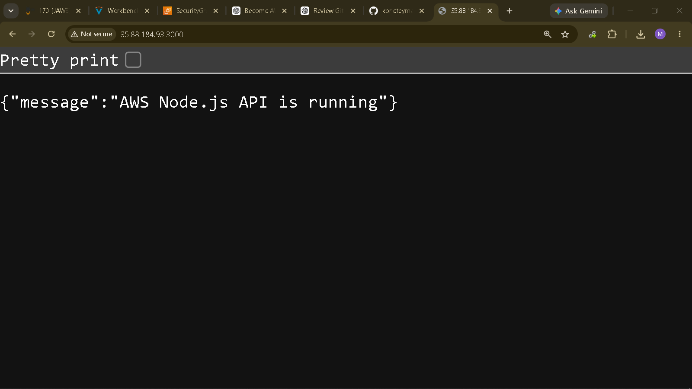
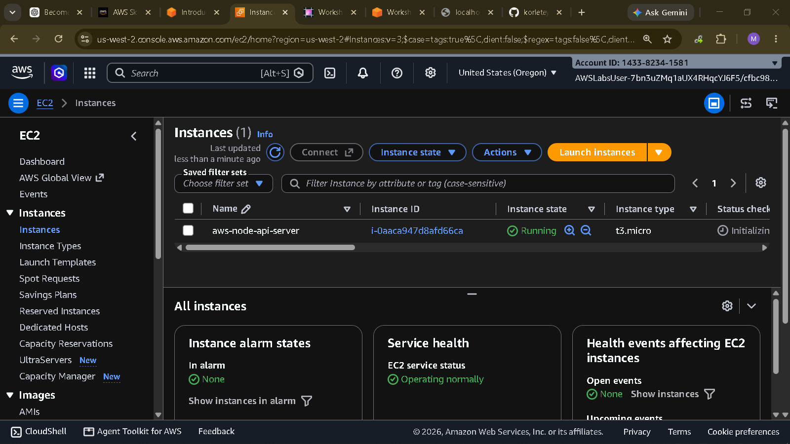
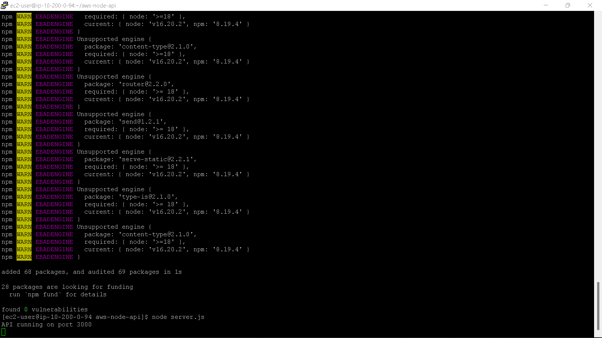

# AWS Node.js REST API

A simple REST API built with Node.js and Express and deployed on an Amazon EC2 instance as part of my hands-on AWS cloud engineering journey.

## Project Overview

This project demonstrates how to take a Node.js REST API from local development and deploy it to an Amazon EC2 instance so that it can be accessed over the internet.

The current version uses an in-memory data store for tasks. Future versions will introduce Amazon RDS PostgreSQL, CloudWatch monitoring, IAM roles, and a more production-oriented deployment architecture.

## Architecture

```text
                  Internet
                     |
                     v
              Amazon EC2 Instance
                     |
                Amazon Linux
                     |
                  Node.js
                     |
                  Express
                     |
                REST API
```

## Technologies

* Node.js
* Express.js
* JavaScript
* Git
* GitHub
* Amazon EC2
* Amazon Linux

## AWS Services

### Amazon EC2

Hosts the Node.js application and provides the compute environment for the API.

### Security Groups

Controls inbound and outbound network traffic to the EC2 instance.

### EC2 Instance Connect

Used to securely connect to the EC2 instance through the AWS Management Console.

## API Endpoints

### Health Check

```text
GET /api/health
```

Example response:

```json
{
  "status": "healthy",
  "service": "AWS Node.js API"
}
```

### Get All Tasks

```text
GET /api/tasks
```

### Get a Single Task

```text
GET /api/tasks/:id
```

### Create a Task

```text
POST /api/tasks
```

Example request:

```json
{
  "title": "Learn AWS EC2"
}
```

### Update a Task

```text
PUT /api/tasks/:id
```

Example request:

```json
{
  "title": "Deploy Node.js API",
  "completed": true
}
```

### Delete a Task

```text
DELETE /api/tasks/:id
```

## Local Setup

Clone the repository:

```bash
git clone YOUR_GITHUB_REPOSITORY_URL
```

Move into the project directory:

```bash
cd aws-node-api
```

Install dependencies:

```bash
npm install
```

Start the application:

```bash
node server.js
```

The API will run on:

```text
http://localhost:3000
```

## AWS EC2 Deployment

The application was deployed to an Amazon EC2 instance running Amazon Linux.

### Deployment Process

1. Launch an Amazon EC2 instance.
2. Configure a Security Group.
3. Connect to the instance using EC2 Instance Connect.
4. Install Node.js.
5. Install Git.
6. Clone this repository.
7. Install the project dependencies.
8. Start the Node.js application.
9. Access the API using the EC2 instance's public IPv4 address.

Example:

```text
http://YOUR_PUBLIC_IP:3000/api/health
```

## Security Group Configuration

The EC2 Security Group was configured to allow the traffic required for the application during development and testing.

The Node.js application currently uses port `3000`.

For a production deployment, the architecture will be improved by placing a reverse proxy such as Nginx in front of the application and restricting direct access to the Node.js port.

## Current Architecture Limitations

This is a learning project and is not yet intended to represent a production-ready architecture.

Current limitations include:

* Task data is stored in memory.
* Data is lost when the application restarts.
* The Node.js application is directly exposed through port 3000.
* HTTPS has not yet been configured.
* CloudWatch monitoring has not yet been configured.
* An IAM instance role has not yet been added.
* There is currently no database.
* There is no load balancer or auto scaling.

## Future Improvements

The next version of this project will introduce:

* Amazon RDS PostgreSQL
* IAM roles
* CloudWatch monitoring
* Nginx reverse proxy
* HTTPS
* Environment variables for configuration
* Improved security group rules
* Application logging
* Application Load Balancer
* Auto Scaling
* Infrastructure as Code with CloudFormation
* CI/CD deployment

## What I Learned

Through this project, I practiced:

* Deploying a Node.js application to Amazon EC2
* Working with Amazon Linux
* Connecting to an EC2 instance using EC2 Instance Connect
* Configuring Security Groups
* Installing and running Node.js on a cloud server
* Deploying an Express REST API
* Understanding the relationship between application code, compute infrastructure and network access
* Troubleshooting connectivity between an EC2 instance and the public internet

## Project Status

Current status: **Version 1 — EC2 deployment complete**

The project will continue to evolve as I develop deeper practical experience with AWS cloud architecture, security, monitoring and DevOps.

## Author

**Korletey Maurice**

Software Engineer | AWS Cloud | Cloud Security

GitHub: https://github.com/korleteymaurice-netizen


<p align="center">
  
  <br>
  <em>Figure 1: AWS Node.js API running successfully in browser</em>
</p>

<p align="center">
  
  <br>
  <em>Figure 2: EC2 Instance running </em>
</p>

<p align="center">
  
  <br>
  <em>Figure 3: EC2 terminal showing Node.js/API running </em>
</p>

<p align="center">
  
  <br>
  <em>Figure 4: security group rules </em>
</p>